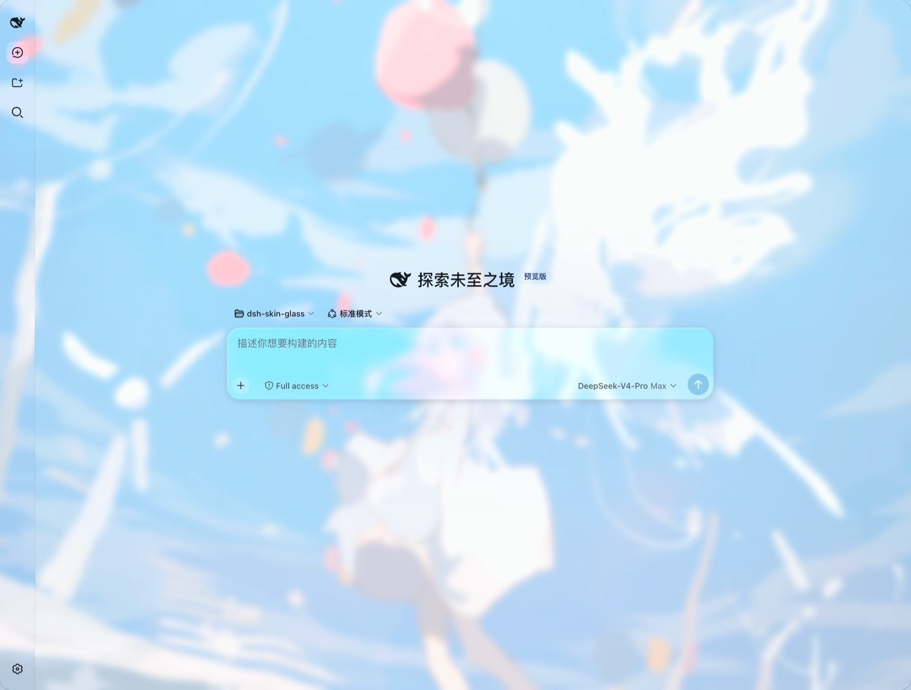
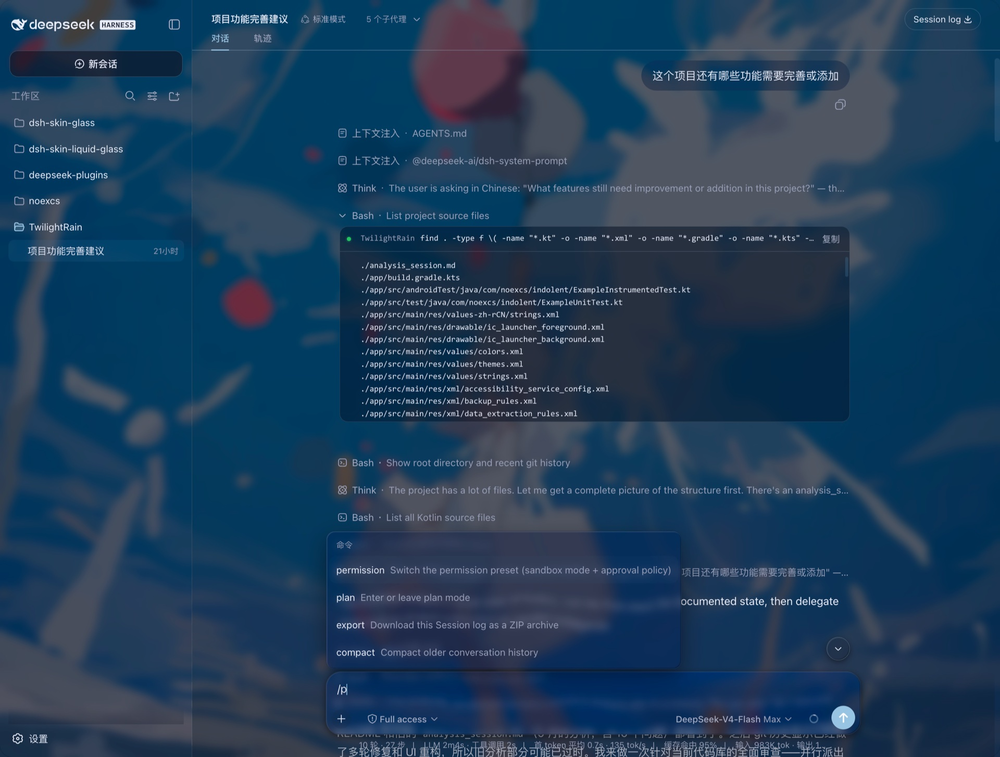

# dsh-skin-glass

A frosted-glass skin plugin for the DeepSeek Harness web GUI.

- 🖼️ Set any wallpaper — it auto-generates light/dark design tokens from the dominant color
- 💎 True per-component `backdrop-filter` glass with adaptive scrim and mirror-edge highlights
- 👓 Readability floor: WCAG AA body contrast at any translucency level

| Light | Dark |
| --- | --- |
|  |  |

## Install

```bash
git clone https://github.com/noexcs/dsh-skin-glass
cd dsh-skin-glass && bash install.sh
```

Or directly from GitHub: `bash <(curl -fsSL https://raw.githubusercontent.com/noexcs/dsh-skin-glass/main/install.sh)`.

Manually, with the dsh CLI (fetches from GitHub):

```bash
dsh plugin --profile web add github:noexcs/dsh-skin-glass
```

Installs into the `web` profile, restarts `dsh web`, then pick an image under **Settings → General → Wallpaper**. Without a wallpaper the skin stays fully inactive.

## Uninstall

```bash
bash uninstall.sh
```

## License

[MIT](LICENSE)
